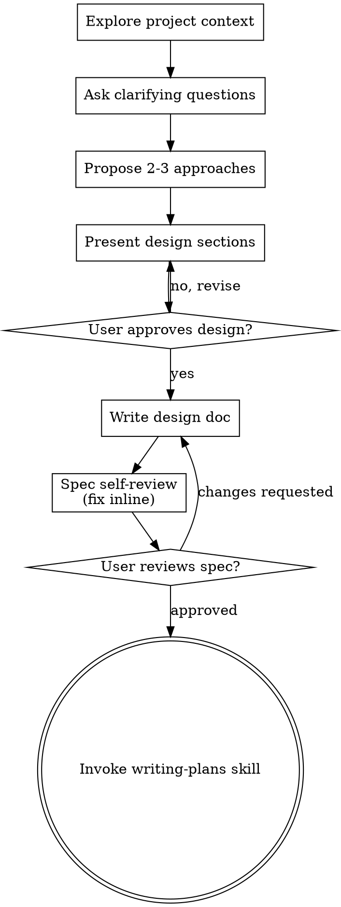

# 将想法梳理为设计

通过自然的协作对话，将想法梳理成完整的设计和规格。

先了解当前项目上下文，再一次询问一个问题以细化想法。理解要构建的内容后，展示设计并取得用户批准。
> 【老王注】这个 skill 是"想清楚了再动手"的守门员：任何创造性工作（新功能、新组件、改行为）都必须先走它——聊明白需求、定下设计，才轮到写代码。

<HARD-GATE>
在展示设计并得到用户批准前，不要调用任何实现类技能、编写代码、搭建项目脚手架或采取任何实现行动。这适用于**所有**项目，无论看起来多么简单。
</HARD-GATE>
> 【老王注】铁律：设计没被用户点头之前，一行代码都不许写。"项目太简单"不是绕过的理由——这条对所有项目生效。

## 反模式：“这太简单，不需要设计”

每个项目都要经过这个过程，包括待办事项清单、单一功能工具和配置改动。“简单”项目最容易因未经审视的假设而造成返工。设计可以很短，真正简单的项目只需几句话，但**必须**展示并获得批准。
> 【老王注】越"简单"的项目越容易栽在没问出口的假设上。设计可以只有几句话，但"呈现 + 获批"这一步不能省。

## 检查清单

必须为以下每一项创建任务，并按顺序完成：

1. **探索项目上下文：**检查文件、文档和近期提交。
2. **适时提议使用可视化伴侣：**不要在开场时提出。首次遇到“展示比文字描述确实更清楚”的问题时，再用单独一条消息提出；用户同意后为其打开浏览器标签页。若始终没有视觉问题，就不要提议。见下方“可视化伴侣”。
3. **询问澄清问题：**一次一个，了解目的、约束和成功标准。
4. **提出 2 到 3 种方案：**包含取舍分析和推荐意见。
5. **展示设计：**按复杂度分段展示，每段后取得用户批准。
6. **编写设计文档：**保存到 `docs/superpowers/specs/YYYY-MM-DD-<topic>-design.md` 并提交。
7. **规格自审：**快速就地检查占位符、矛盾、歧义和范围，见下文。
8. **让用户审阅书面规格：**继续前请用户审阅规格文件。
9. **转入实现：**调用 `writing-plans` 技能创建实施计划。
> 【老王注】九步按顺序走：摸底 → 按需提可视化 → 一次一问澄清 → 给 2-3 个方案 → 分段过设计 → 落盘 → 自审 → 用户审 → 转 writing-plans。
> 【老王注】第 2 步最容易做错：可视化伴侣是"真出现视觉问题才提"，不是开场白——全程没视觉问题就全程不提。

## 流程图
> 【老王注】这张图里只有两个"回头点"：设计被打回就改设计，规格被打回就改规格——没有绕过用户直接往前冲的边。

**终止状态是调用 `writing-plans`。**不要调用 `frontend-design`、`mcp-builder` 或任何其他实现类技能。头脑梳理后的唯一下一项技能是 `writing-plans`。
> 【老王注】终点只有一个：writing-plans。脑子里冒出"反正设计清楚了，直接开写"的念头时，回来读这句。

## 过程

**理解想法：**

- 先查看当前项目状态，包括文件、文档和近期提交。
- 提出细节问题前评估范围。若需求包含多个独立子系统，例如“构建带有聊天、文件存储、计费和分析功能的平台”，立即指出这一点。不要在本应先拆分的项目上反复细化细节。
- 若项目过大、无法由单份规格承载，协助用户拆为子项目：独立部分有哪些、如何关联、按什么顺序构建？随后按正常设计流程先梳理第一个子项目。每个子项目都有独立的“规格 → 计划 → 实现”周期。
- 对范围合适的项目，一次询问一个问题来细化想法。
- 尽可能使用选择题，也可使用开放式问题。
- 每条消息只问一个问题；若一个话题需要进一步探索，将其拆成多个问题。
- 重点理解目的、约束和成功标准。
> 【老王注】一次只问一个、优先选择题。发现需求其实是多个独立子系统时，先拆项目再聊细节——别给一个该分解的大项目做细节澄清。

**探索方案：**

- 提出 2 到 3 种不同方案及其取舍。
- 以对话形式展示选项，给出推荐和理由。
- 先展示推荐方案，并说明原因。
> 【老王注】只给一个方案等于把思考外包给用户；给方案时把你推荐的那个放最前面，并讲清为什么。

**展示设计：**

- 确信已经理解要构建的内容后，展示设计。
- 每节篇幅与复杂度匹配：直观内容可只写几句话，细微复杂的内容最多 200 至 300 词。
- 每节之后询问“到目前为止是否正确”。
- 覆盖架构、组件、数据流、错误处理和测试。
- 如有内容难以理解，随时返回澄清。
> 【老王注】每段都问一句"到这儿对吗"——把返工拦在早期，比整份设计写完再推翻便宜得多。

**为隔离性和清晰度而设计：**

- 将系统拆为更小的单元：每个单元只承担一个清晰目的，通过定义良好的接口通信，并可独立理解和测试。
- 对每个单元，都应能回答：它做什么、如何使用、依赖什么？
- 不读内部实现，别人能否理解单元的功能？修改内部是否不会破坏调用方？若不能，说明边界仍需改进。
- 边界清晰的小单元也更容易处理。一次能放进上下文的代码更易推理，文件聚焦时改动更可靠。文件不断变大往往说明它承担了过多职责。
> 【老王注】边界好不好的试金石：不看内部能讲清它干什么、改内部不炸调用方。文件越写越长，通常就是它管得太宽的信号。

**在现有代码库中工作：**

- 提出改动前先探索当前结构，并遵循现有模式。
- 若现有代码的问题会影响本次工作，例如文件过大、边界不清或职责缠结，应在设计中纳入针对性改进，如同优秀开发者会改善正在处理的代码。
- 不要提出无关重构，始终聚焦于当前目标。
> 【老王注】顺手改进挡路的坏代码可以，顺手搞无关重构不行——所有改动都得服务于当前目标。

## 设计之后

**文档：**

- 将已验证的设计规格写入 `docs/superpowers/specs/YYYY-MM-DD-<topic>-design.md`。
  - 用户对规格位置的偏好优先于此默认位置。
- 如可用，使用 `elements-of-style:writing-clearly-and-concisely` 技能。
- 将设计文档提交到 Git。
> 【老王注】规格路径带日期前缀，写完必须 commit——不进 git 的设计文档等于没写。

**规格自审：**
写完规格文档后，以全新的视角检查：

1. **扫描占位符：**是否有 “TBD”“TODO”、不完整章节或模糊需求？修复它们。
2. **内部一致性：**章节之间是否矛盾？架构是否符合功能描述？
3. **范围检查：**它是否聚焦到足以支撑一份实施计划，还是需要拆分？
4. **歧义检查：**是否有需求可被作两种解释？若有，选择一种并明确写出。

就地修复发现的问题。无需再次自审，修好后继续即可。
> 【老王注】自审四件事：占位符、自相矛盾、范围超标、歧义。发现问题当场改掉接着走，不搞"再审一轮"的形式主义。

**用户审阅关卡：**
规格自审通过后，继续之前请用户审阅书面规格：

> “规格已写入并提交至 `<path>`。开始编写实施计划前，请审阅并告知是否需要修改。”

等待用户回复。若用户要求修改，完成修改后重新运行规格自审。仅在用户批准后继续。
> 【老王注】这是门槛不是通知：用户没回话就停在这里等。要改就改完重跑自审，通过了才往下走。

**实现：**

- 调用 `writing-plans` 技能创建详细实施计划。
- 不要调用其他技能；下一步只能是 `writing-plans`。
> 【老王注】下一步永远是 writing-plans，别自作主张改调别的 skill。

## 关键原则

- **一次一个问题：**不要用多个问题压垮对方。
- **优先选择题：**能用选择题时，它通常比开放题更容易回答。
- **严格遵守 YAGNI：**从所有设计中移除不必要的功能。
- **探索替代方案：**确定方案前始终提出 2 到 3 个方案。
- **增量验证：**展示设计、获得批准后再继续。
- **保持灵活：**内容不合理时返回澄清。
> 【老王注】YAGNI 是最容易被嘴上遵守、实际违反的一条——设计里每个功能都该问一句"用户真的要么"。

## 可视化伴侣

一个基于浏览器的伴侣工具，可在头脑梳理中展示模型图、示意图和视觉选项。它是工具而非模式。接受该工具意味着它可用于受益于视觉呈现的问题，不代表每个问题都必须通过浏览器处理。
> 【老王注】可视化伴侣是工具不是模式：就算用户批准了，也只有"看比读更清楚"的问题才进浏览器，其余留在终端。

**提议使用伴侣（适时）：**不要在开场时提出。等到某个问题确实“展示比描述更清楚”时再提出，例如真正的模型图、布局或图表问题，而非仅仅是 UI *话题*。首次发生时，以单独一条消息提出：
> “接下来这一部分展示出来可能更容易理解。我可以在浏览器标签页中逐步整理模型图、图表和对比内容。它仍是新功能，可能消耗较多 token。需要我打开吗？”

**这项提议必须独占一条消息。**只包含提议，不要混入澄清问题、总结或其他内容。等待用户回复。若用户接受，使用 `--open` 启动服务，让浏览器自动打开第一个页面。若用户拒绝，继续纯文本交流，除非用户再次主动提起，否则不要再次提议。
> 【老王注】提议必须单独成一条消息，不许夹带澄清问题或总结——夹带了用户就不知道该先答哪个。被拒绝就别再提，除非用户自己提起。

**逐题决策：**即使用户已接受，也要针对**每个问题**决定使用浏览器还是终端。判断标准是：**用户看见它是否会比读到它理解得更好？**

- 对本质上是视觉内容的内容使用**浏览器**，例如模型图、线框图、布局对比、架构图和并排视觉设计。
- 对本质上是文本内容的内容使用**终端**，例如需求问题、概念选择、取舍列表、A/B/C/D 文本选项和范围决策。

有关 UI 话题的问题不自动等于视觉问题。“在这个语境中个性是什么意思？”是概念问题，应使用终端；“哪个向导布局更好？”是视觉问题，应使用浏览器。
> 【老王注】判断标准一句话：答案是"词"就用终端，答案是"样子"就用浏览器。聊 UI 的话题不等于视觉问题。

若用户同意使用伴侣，继续前阅读详细指南：
`skills/brainstorming/visual-companion.md`
