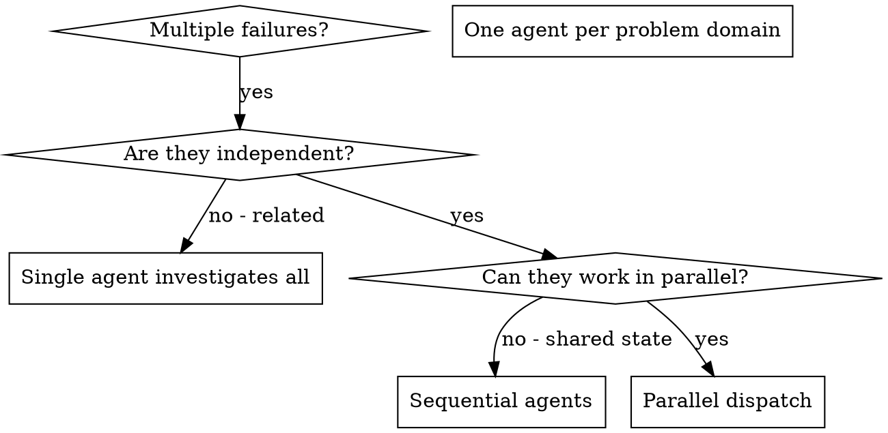

# 并行派发 Agent

## 概述
> 【老王注】这节讲核心打法：每个独立问题域派一个 agent，它的上下文由你亲手拼装，绝不让它继承你的会话历史。
> 【老王注】本质是用隔离换两样东西：并行省时间，你的主 context 省下来做协调和整合。

将任务委派给拥有隔离上下文的专门 Agent。精确编写它们的指令和上下文，确保它们聚焦并完成任务。它们绝不能继承当前会话的上下文或历史；由你构建完成任务所需的全部信息。这也能保留你的上下文，用于协调工作。

面对多个互不相关的失败（不同测试文件、子系统或缺陷）时，按顺序排查会浪费时间。每项排查彼此独立，可以并行进行。

**核心原则：**每个独立问题域派发一个 Agent，让它们并发工作。

## 何时使用
> 【老王注】判断标准就一条：失败互相独立、无共享状态才并行；有牵连就用一个 agent 顺藤摸瓜。
> 【老王注】常见坑：表面是多个失败、实际同一根因——硬拆开派活只会收回三份重复结论。



**适用情形：**
- 3 个以上测试文件失败，且根因不同
- 多个子系统彼此独立地出现故障
- 每个问题都无需其他问题的上下文即可理解
- 各项排查之间没有共享状态

**不适用情形：**
- 失败彼此相关，修复一个可能解决其他问题
- 必须了解完整系统状态
- Agent 会相互干扰

## 工作模式
> 【老王注】四步流水线：分域 → 写任务 → 同一条回复里并发派发 → 回收整合。最容易翻车的是第 1 步（域切错）和第 4 步（不验证就收）。

### 1. 识别独立问题域
> 【老王注】分组标准是"修 A 不影响 B"，不是按文件数量均分——域切错了，后面全白搭。

按损坏的部分分组：
- File A tests: Tool approval flow
- File B tests: Batch completion behavior
- File C tests: Abort functionality

每个问题域相互独立，修复工具审批不会影响中止测试。

### 2. 创建聚焦的 Agent 任务
> 【老王注】任务四件套缺一不可：范围、目标、约束、预期输出。少写约束，agent 会顺手重构你没让它碰的代码。

每个 Agent 都应获得：
- **明确范围：**一个测试文件或子系统
- **清晰目标：**使这些测试通过
- **约束：**不要修改其他代码
- **预期输出：**发现与修复内容的摘要

### 3. 并行派发
> 【老王注】铁律：所有派发必须写在同一条回复里才是真并行；分多条回复发就是串行，加速效果直接清零。

在同一条回复中发出全部三个子 Agent 派发请求，它们就会并行运行：

```text
Subagent (general-purpose): "Fix agent-tool-abort.test.ts failures"
Subagent (general-purpose): "Fix batch-completion-behavior.test.ts failures"
Subagent (general-purpose): "Fix tool-approval-race-conditions.test.ts failures"
# All three run concurrently.
```

一条回复中的多个派发调用等于并行执行；每条回复只派发一个则是串行执行。

### 4. 审查并集成
> 【老王注】agent 交活不等于完事：读摘要、查冲突、跑全量测试，一步不能省——并行省下的时间别在整合时赔回去。

Agent 返回后：
- 阅读每份摘要
- 验证修复之间没有冲突
- 运行完整测试套件
- 集成全部改动

## Agent 提示词结构
> 【老王注】好 prompt 三要素：聚焦、自包含、说清要什么输出。agent 看不到你的会话，"那个 race condition"这种指代对它等于什么都没说。

好的 Agent 提示词具备：
1. **聚焦：**一个清晰的问题域
2. **自包含：**理解问题所需的全部上下文
3. **明确输出：**说明 Agent 应返回什么

```markdown
Fix the 3 failing tests in src/agents/agent-tool-abort.test.ts:

1. "should abort tool with partial output capture" - expects 'interrupted at' in message
2. "should handle mixed completed and aborted tools" - fast tool aborted instead of completed
3. "should properly track pendingToolCount" - expects 3 results but gets 0

These are timing/race condition issues. Your task:

1. Read the test file and understand what each test verifies
2. Identify root cause - timing issues or actual bugs?
3. Fix by:
   - Replacing arbitrary timeouts with event-based waiting
   - Fixing bugs in abort implementation if found
   - Adjusting test expectations if testing changed behavior

Do NOT just increase timeouts - find the real issue.

Return: Summary of what you found and what you fixed.
```

## 常见错误
> 【老王注】四种死法指向同一本质：你把 agent 当知己，它其实是个零上下文的外包——需求写多细，活才干多细。

**❌ 范围太宽：**“修复全部测试”会让 Agent 无从下手
**✅ 范围明确：**“修复 `agent-tool-abort.test.ts`”能保持聚焦

**❌ 没有上下文：**“修复竞态条件”没有说明位置
**✅ 提供上下文：**附上错误信息和测试名称

**❌ 没有约束：**Agent 可能重构所有内容
**✅ 给出约束：**“不要修改生产代码”或“只修复测试”

**❌ 输出含糊：**“修好它”无法得知改动内容
**✅ 输出明确：**“返回根因和改动摘要”

## 何时不要使用
> 【老王注】红旗清单：根因可能相关、需要全局视野、还在摸索阶段、会抢同一批文件——中任何一条都别并行。

**关联失败：**修复一个可能修复其他问题，应先一起排查
**需要完整上下文：**理解问题需要看到整个系统
**探索式调试：**尚不清楚哪里出了问题
**共享状态：**Agent 会相互干扰，例如编辑相同文件或使用相同资源

## 会话中的真实示例
> 【老王注】实战复盘：6 个失败 3 个文件，按问题域切三刀。注意三个 agent 的修法完全不同——这恰好证明域切对了。

**场景：**一次重大重构后，3 个文件中出现 6 个测试失败

**失败项：**
- agent-tool-abort.test.ts: 3 failures (timing issues)
- batch-completion-behavior.test.ts: 2 failures (tools not executing)
- tool-approval-race-conditions.test.ts: 1 failure (execution count = 0)

**决策：**问题域相互独立，中止逻辑、批量完成和竞态条件彼此分开。

**派发：**
```
Agent 1 → Fix agent-tool-abort.test.ts
Agent 2 → Fix batch-completion-behavior.test.ts
Agent 3 → Fix tool-approval-race-conditions.test.ts
```

**结果：**
- Agent 1: Replaced timeouts with event-based waiting
- Agent 2: Fixed event structure bug (threadId in wrong place)
- Agent 3: Added wait for async tool execution to complete

**集成：**所有修复相互独立、没有冲突，完整测试套件通过。

**节省时间：**3 个问题并行解决，而非串行处理。

## 主要收益
> 【老王注】收益就两点：时间并行、上下文隔离。前提是域切得对，切错了收益全变成冲突。

1. **并行化：**多项排查同时进行
2. **聚焦：**每个 Agent 范围更窄，需要跟踪的上下文更少
3. **独立性：**Agent 不会相互干扰
4. **速度：**用解决 1 个问题的时间解决 3 个问题

## 验证
> 【老王注】最后这道闸别跳：agent 会犯系统性错误（比如不约而同误改同一处），全量测试加抽查是兜底。

Agent 返回后：
1. **审查每份摘要：**了解发生了哪些改动
2. **检查冲突：**Agent 是否编辑了相同代码？
3. **运行完整套件：**验证所有修复能共同工作
4. **抽查：**Agent 可能犯系统性错误

## 实际成效
> 【老王注】数据背书：3 个 agent 并行、零冲突收尾。但这是域天然独立的理想案例，别当万能模板套。

来自一次调试会话（2025-10-03）：
- 3 个文件中有 6 个失败
- 并行派发 3 个 Agent
- 全部排查并发完成
- 全部修复成功集成
- Agent 改动之间零冲突
