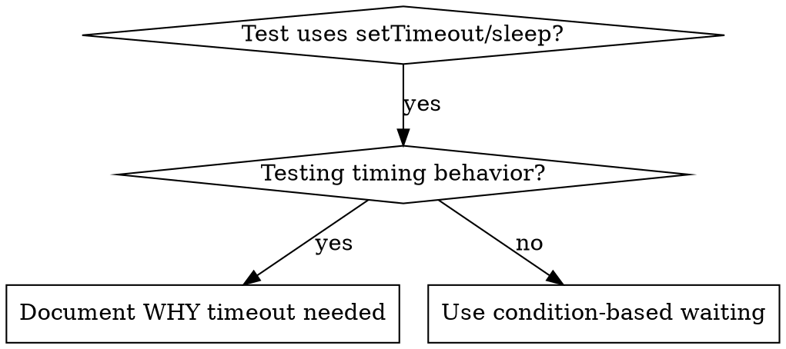

# Condition-Based Waiting

## Overview
> 【老王注】测试里随手写 sleep(50) 就是在猜时长：快机器能过，CI 或高负载就炸，这就是 flaky 测试的主要来源。
> 【老王注】核心原则：等你真正关心的那个条件成立，别猜它大概要多久。

Flaky tests often guess at timing with arbitrary delays. This creates race conditions where tests pass on fast machines but fail under load or in CI.

**Core principle:** Wait for the actual condition you care about, not a guess about how long it takes.

## When to Use
> 【老王注】判断标准：只要不是专门在测计时行为（防抖、节流），所有 setTimeout/sleep 都该换成条件等待；实在要用固定时长，必须写注释说清为什么。



**Use when:**
- Tests have arbitrary delays (`setTimeout`, `sleep`, `time.sleep()`)
- Tests are flaky (pass sometimes, fail under load)
- Tests timeout when run in parallel
- Waiting for async operations to complete

**Don't use when:**
- Testing actual timing behavior (debounce, throttle intervals)
- Always document WHY if using arbitrary timeout

## Core Pattern
> 【老王注】改造前后对照：把"睡 50ms 碰运气"换成"轮询到结果出现为止"，等待时间自适应环境快慢。

```typescript
// ❌ BEFORE: Guessing at timing
await new Promise(r => setTimeout(r, 50));
const result = getResult();
expect(result).toBeDefined();

// ✅ AFTER: Waiting for condition
await waitFor(() => getResult() !== undefined);
const result = getResult();
expect(result).toBeDefined();
```

## Quick Patterns
> 【老王注】速查表：等事件、等状态、等数量、等文件、等复合条件，都是同一个 waitFor 的不同断言。

| Scenario | Pattern |
|----------|---------|
| Wait for event | `waitFor(() => events.find(e => e.type === 'DONE'))` |
| Wait for state | `waitFor(() => machine.state === 'ready')` |
| Wait for count | `waitFor(() => items.length >= 5)` |
| Wait for file | `waitFor(() => fs.existsSync(path))` |
| Complex condition | `waitFor(() => obj.ready && obj.value > 10)` |

## Implementation
> 【老王注】通用轮询函数三要素：条件成立立刻返回、每 10ms 查一次、超时抛出带描述的错误。完整可用的领域封装见同目录 condition-based-waiting-example.ts。

Generic polling function:
```typescript
async function waitFor<T>(
  condition: () => T | undefined | null | false,
  description: string,
  timeoutMs = 5000
): Promise<T> {
  const startTime = Date.now();

  while (true) {
    const result = condition();
    if (result) return result;

    if (Date.now() - startTime > timeoutMs) {
      throw new Error(`Timeout waiting for ${description} after ${timeoutMs}ms`);
    }

    await new Promise(r => setTimeout(r, 10)); // Poll every 10ms
  }
}
```

See `condition-based-waiting-example.ts` in this directory for complete implementation with domain-specific helpers (`waitForEvent`, `waitForEventCount`, `waitForEventMatch`) from actual debugging session.

## Common Mistakes
> 【老王注】三个常见坑：轮询太勤烧 CPU（10ms 一次足够）、不设超时变死循环、在循环外缓存状态拿到过期数据。

**❌ Polling too fast:** `setTimeout(check, 1)` - wastes CPU
**✅ Fix:** Poll every 10ms

**❌ No timeout:** Loop forever if condition never met
**✅ Fix:** Always include timeout with clear error

**❌ Stale data:** Cache state before loop
**✅ Fix:** Call getter inside loop for fresh data

## When Arbitrary Timeout IS Correct
> 【老王注】固定时长不是全禁：测的就是计时行为本身时可以用，但要满足三条——先等触发条件、时长有依据（不是猜的）、注释写清原因。

```typescript
// Tool ticks every 100ms - need 2 ticks to verify partial output
await waitForEvent(manager, 'TOOL_STARTED'); // First: wait for condition
await new Promise(r => setTimeout(r, 200));   // Then: wait for timed behavior
// 200ms = 2 ticks at 100ms intervals - documented and justified
```

**Requirements:**
1. First wait for triggering condition
2. Based on known timing (not guessing)
3. Comment explaining WHY

## Real-World Impact
> 【老王注】实战成绩：15 个 flaky 测试改造后通过率 60% → 100%，执行还快了 40%——不等多余的时间，也不再来回重跑。

From debugging session (2025-10-03):
- Fixed 15 flaky tests across 3 files
- Pass rate: 60% → 100%
- Execution time: 40% faster
- No more race conditions
