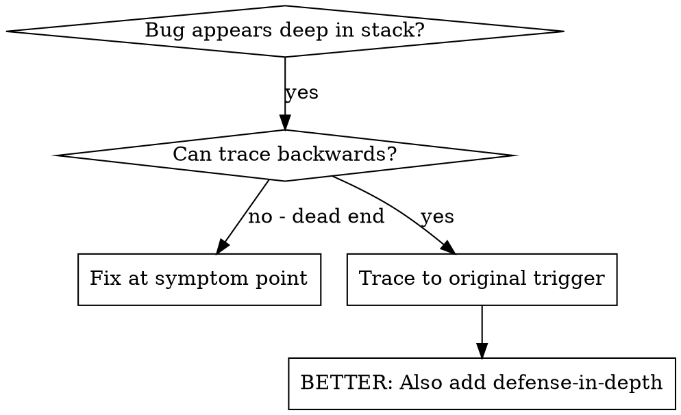
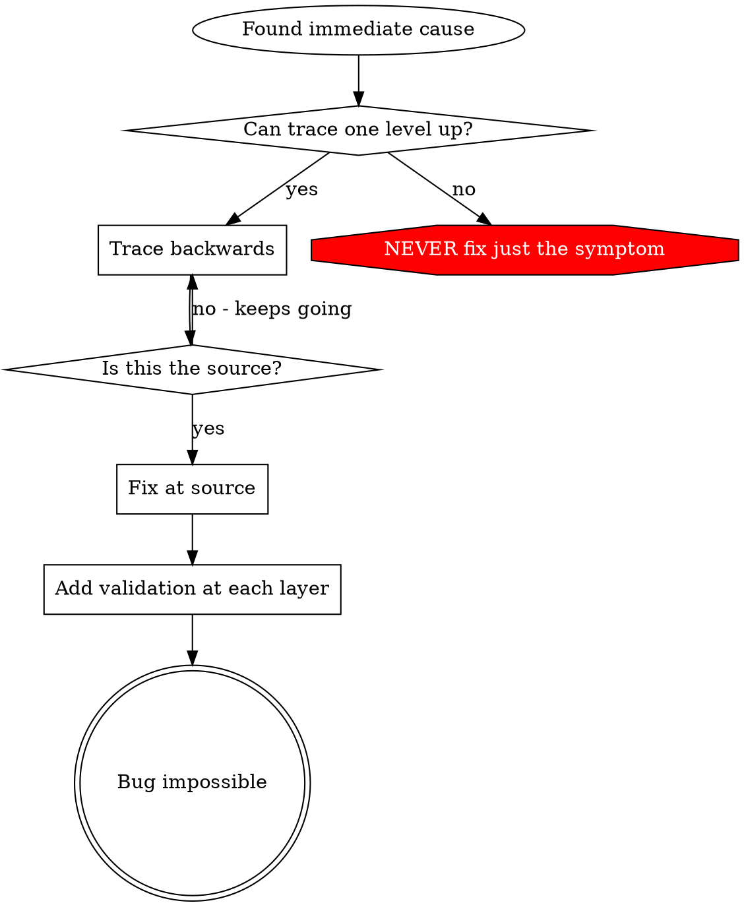

# Root Cause Tracing

## Overview
> 【老王注】bug 经常在调用栈很深的地方才爆出来（比如在源码目录里跑了 git init），在报错点就地修只是治症状。
> 【老王注】核心打法：沿调用链一路往回追，追到最初的触发点，在源头修。

Bugs often manifest deep in the call stack (git init in wrong directory, file created in wrong location, database opened with wrong path). Your instinct is to fix where the error appears, but that's treating a symptom.

**Core principle:** Trace backward through the call chain until you find the original trigger, then fix at the source.

## When to Use
> 【老王注】适用场景：错误爆在执行深处、调用链很长、搞不清脏数据是哪儿来的。决策见下面的流程图。



**Use when:**
- Error happens deep in execution (not at entry point)
- Stack trace shows long call chain
- Unclear where invalid data originated
- Need to find which test/code triggers the problem

## The Tracing Process
> 【老王注】下面五步是一个完整示范：从症状出发，每层问两个问题——"谁调用了它"和"传进来的值是什么"——一直追到空字符串这种离谱输入的出生地。

### 1. Observe the Symptom
```
Error: git init failed in ~/project/packages/core
```

### 2. Find Immediate Cause
**What code directly causes this?**
```typescript
await execFileAsync('git', ['init'], { cwd: projectDir });
```

### 3. Ask: What Called This?
```typescript
WorktreeManager.createSessionWorktree(projectDir, sessionId)
  → called by Session.initializeWorkspace()
  → called by Session.create()
  → called by test at Project.create()
```

### 4. Keep Tracing Up
**What value was passed?**
- `projectDir = ''` (empty string!)
- Empty string as `cwd` resolves to `process.cwd()`
- That's the source code directory!

### 5. Find Original Trigger
**Where did empty string come from?**
```typescript
const context = setupCoreTest(); // Returns { tempDir: '' }
Project.create('name', context.tempDir); // Accessed before beforeEach!
```

## Adding Stack Traces
> 【老王注】手动追不动时就上探针：在危险操作前打印目录、cwd、环境变量和完整调用栈。测试里要用 console.error，logger 可能被吞掉。

When you can't trace manually, add instrumentation:

```typescript
// Before the problematic operation
async function gitInit(directory: string) {
  const stack = new Error().stack;
  console.error('DEBUG git init:', {
    directory,
    cwd: process.cwd(),
    nodeEnv: process.env.NODE_ENV,
    stack,
  });

  await execFileAsync('git', ['init'], { cwd: directory });
}
```

**Critical:** Use `console.error()` in tests (not logger - may not show)

**Run and capture:**
```bash
npm test 2>&1 | grep 'DEBUG git init'
```

**Analyze stack traces:**
- Look for test file names
- Find the line number triggering the call
- Identify the pattern (same test? same parameter?)

## Finding Which Test Causes Pollution
> 【老王注】知道测试跑完留下了脏东西、却不知道是哪个测试干的？用本目录的 find-polluter.sh 二分：逐个跑、逐个查，抓到第一个肇事者就停。

If something appears during tests but you don't know which test:

Use the bisection script `find-polluter.sh` in this directory:

```bash
./find-polluter.sh '.git' 'src/**/*.test.ts'
```

Runs tests one-by-one, stops at first polluter. See script for usage.

## Real Example: Empty projectDir
> 【老王注】真实案例：.git 被建进了源码目录。顺着五级调用链追上去，根因是测试在 beforeEach 之前访问了还是空字符串的 tempDir。

**Symptom:** `.git` created in `packages/core/` (source code)

**Trace chain:**
1. `git init` runs in `process.cwd()` ← empty cwd parameter
2. WorktreeManager called with empty projectDir
3. Session.create() passed empty string
4. Test accessed `context.tempDir` before beforeEach
5. setupCoreTest() returns `{ tempDir: '' }` initially

**Root cause:** Top-level variable initialization accessing empty value

**Fix:** Made tempDir a getter that throws if accessed before beforeEach

**Also added defense-in-depth:**
- Layer 1: Project.create() validates directory
- Layer 2: WorkspaceManager validates not empty
- Layer 3: NODE_ENV guard refuses git init outside tmpdir
- Layer 4: Stack trace logging before git init

## Key Principle
> 【老王注】一张图记住闭环：能往上追就继续追，追到源头才修，修完再逐层加校验，让同类 bug 在结构上不可能复发；只在报错点打补丁是永远禁止的。



**NEVER fix just where the error appears.** Trace back to find the original trigger.

## Stack Trace Tips
> 【老王注】埋探针四个要点：测试里用 console.error、在危险操作之前打日志、带上下文（目录/cwd/环境变量）、用 new Error().stack 抓完整调用链。

**In tests:** Use `console.error()` not logger - logger may be suppressed
**Before operation:** Log before the dangerous operation, not after it fails
**Include context:** Directory, cwd, environment variables, timestamps
**Capture stack:** `new Error().stack` shows complete call chain

## Real-World Impact
> 【老王注】实战成绩：五级回溯找到根因、源头修复、再加四层防御，1847 个测试全过、零污染。

From debugging session (2025-10-03):
- Found root cause through 5-level trace
- Fixed at source (getter validation)
- Added 4 layers of defense
- 1847 tests passed, zero pollution
