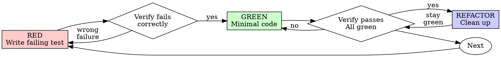

# 测试驱动开发（TDD）

## 概述
> 【老王注】这个 skill 的核心不是教 TDD 流程——模型早就懂。真正的价值在后面的借口对照表和红旗清单：压力一大模型就会给自己找理由跳过 TDD，这份文件是用来堵嘴的。
> 【老王注】一句话精髓：没亲眼看测试失败，就等于没测。

先编写测试，观察它失败，再编写使其通过的最小代码。

**核心原则：**若未亲眼看到测试失败，就无法确认它测试的是正确内容。

**违反规则的字面要求，同样是违反规则的精神。**

## 何时使用
> 【老王注】默认全用，例外只有三种且要人类点头。「就这一次跳过」的念头本身就是红旗。

**始终适用：**
- New features
- Bug fixes
- Refactoring
- Behavior changes

**例外情况，须征得人类协作者同意：**
- Throwaway prototypes
- Generated code
- Configuration files

若想着“这次跳过 TDD”，立即停止。这是在自我辩解。

## 铁律
> 【老王注】铁律：先写了实现？删掉重来。「留作参考」也是借口——留着就会忍不住抄，等于后补测试。

```
没有先失败的测试，不得编写生产代码
```

先于测试编写了代码？删除它，重新开始。

**没有例外：**
- Don't keep it as "reference"
- Don't "adapt" it while writing tests
- Don't look at it
- Delete means delete

必须从测试开始重新实现。

## 红-绿-重构
> 【老王注】红-绿-重构循环。两个 verify 节点是灵魂：红了要确认是「预期的失败」，重构后必须保持绿。



### 红：编写失败测试
> 【老王注】一次只测一个行为，名字说清楚测什么。下面反面例子的毛病：断言全打在 mock 上，实现改没改对它根本不知道。

编写一个展示预期行为的最小测试。

<Good>
```typescript
test('retries failed operations 3 times', async () => {
  let attempts = 0;
  const operation = () => {
    attempts++;
    if (attempts < 3) throw new Error('fail');
    return 'success';
  };

  const result = await retryOperation(operation);

  expect(result).toBe('success');
  expect(attempts).toBe(3);
});
```
Clear name, tests real behavior, one thing
</Good>

<Bad>
```typescript
test('retry works', async () => {
  const mock = jest.fn()
    .mockRejectedValueOnce(new Error())
    .mockRejectedValueOnce(new Error())
    .mockResolvedValueOnce('success');
  await retryOperation(mock);
  expect(mock).toHaveBeenCalledTimes(3);
});
```
Vague name, tests mock not code
</Bad>

**Requirements:**
- One behavior
- Clear name
- Real code (no mocks unless unavoidable)

### 验证红：观察它失败
> 【老王注】全篇最关键一步：必须亲眼看测试失败，且失败原因要是「功能还没写」，不是拼写错误。
> 【老王注】一上来就过？说明在测已有行为，这测试作废重写。

**强制执行，绝不可跳过。**

```bash
npm test path/to/test.test.ts
```

确认：
- Test fails (not errors)
- Failure message is expected
- Fails because feature missing (not typos)

**测试通过？**说明正在测试已有行为，应修正测试。

**测试报错？**修正错误，重新运行直到它以正确原因失败。

### 绿：最小代码
> 【老王注】只写刚好让测试过的代码。多设计一个参数都是 YAGNI——需求真来了再加，那时会有新测试罩着。

编写能使测试通过的最简单代码。

<Good>
```typescript
async function retryOperation<T>(fn: () => Promise<T>): Promise<T> {
  for (let i = 0; i < 3; i++) {
    try {
      return await fn();
    } catch (e) {
      if (i === 2) throw e;
    }
  }
  throw new Error('unreachable');
}
```
Just enough to pass
</Good>

<Bad>
```typescript
async function retryOperation<T>(
  fn: () => Promise<T>,
  options?: {
    maxRetries?: number;
    backoff?: 'linear' | 'exponential';
    onRetry?: (attempt: number) => void;
  }
): Promise<T> {
  // YAGNI
}
```
Over-engineered
</Bad>

不要增加功能、重构其他代码，或做超出测试范围的“改进”。

### 验证绿：观察它通过
> 【老王注】绿了还要看全量测试没破、输出干净没警告。测试挂了改代码，不许改测试迁就实现。

**MANDATORY.**

```bash
npm test path/to/test.test.ts
```

确认：
- Test passes
- Other tests still pass
- Output pristine (no errors, warnings)

**测试失败？**修复代码，而非测试。

**其他测试失败？**立即修复。

### 重构：清理
> 【老王注】只有绿了才能动，只清理不加行为——重构全程测试保持绿。

仅在变绿后执行：
- Remove duplication
- Improve names
- Extract helpers

保持测试为绿，不要增加行为。

### 重复

为下一个功能编写下一个失败测试。

## 好测试
> 【老王注】名字里带 "and" 就是在测两件事，拆开。

| 质量 | 好 | 差 |
|---------|------|-----|
| **Minimal** | One thing. "and" in name? Split it. | `test('validates email and domain and whitespace')` |
| **Clear** | Name describes behavior | `test('test1')` |
| **Shows intent** | Demonstrates desired API | Obscures what code should do |

## 为什么顺序重要
> 【老王注】这一节是全篇弹药库：逐条反驳「为啥要先写测试」的经典抬杠——每条都是压力下模型会对自己说的借口。

**"I'll write tests after to verify it works"**
> 【老王注】后补的测试从来没红过——一写就过什么都证明不了，你永远不知道它能不能抓住 bug。

Tests written after code pass immediately. Passing immediately proves nothing:
- Might test wrong thing
- Might test implementation, not behavior
- Might miss edge cases you forgot
- You never saw it catch the bug

Test-first forces you to see the test fail, proving it actually tests something.

**"I already manually tested all the edge cases"**
> 【老王注】手动点过一遍不算数：没记录、没法重跑、下次改代码还得再点一遍。

Manual testing is ad-hoc. You think you tested everything but:
- No record of what you tested
- Can't re-run when code changes
- Easy to forget cases under pressure
- "It worked when I tried it" ≠ comprehensive

Automated tests are systematic. They run the same way every time.

**"Deleting X hours of work is wasteful"**
> 【老王注】典型沉没成本：时间已经花了，真正浪费的是把不敢信的代码留在仓库里。

Sunk cost fallacy. The time is already gone. Your choice now:
- Delete and rewrite with TDD (X more hours, high confidence)
- Keep it and add tests after (30 min, low confidence, likely bugs)

The "waste" is keeping code you can't trust. Working code without real tests is technical debt.

**"TDD is dogmatic, being pragmatic means adapting"**
> 【老王注】拿「务实」当跳过测试的幌子，结果就是在生产环境调试——那才叫慢。

TDD IS pragmatic:
- Finds bugs before commit (faster than debugging after)
- Prevents regressions (tests catch breaks immediately)
- Documents behavior (tests show how to use code)
- Enables refactoring (change freely, tests catch breaks)

"Pragmatic" shortcuts = debugging in production = slower.

**"Tests after achieve the same goals - it's spirit not ritual"**
> 【老王注】最狡猾的借口。后补测试回答「这代码干了什么」，先写测试回答「这代码该干什么」——前者被实现带着跑，漏掉你想不到的边界。

No. Tests-after answer "What does this do?" Tests-first answer "What should this do?"

Tests-after are biased by your implementation. You test what you built, not what's required. You verify remembered edge cases, not discovered ones.

Tests-first force edge case discovery before implementing. Tests-after verify you remembered everything (you didn't).

30 minutes of tests after ≠ TDD. You get coverage, lose proof tests work.

## 常见自我辩解
> 【老王注】借口对照表，这就是核心武器：写代码前脑子里冒出左列任何一句，直接拿右列打脸。
> 【老王注】留意「Test hard = design unclear」：测试难写不是测试的错，是设计该改了。

| 借口 | 事实 |
|--------|---------|
| "Too simple to test" | Simple code breaks. Test takes 30 seconds. |
| "I'll test after" | Tests passing immediately prove nothing. |
| "Tests after achieve same goals" | Tests-after = "what does this do?" Tests-first = "what should this do?" |
| "Already manually tested" | Ad-hoc ≠ systematic. No record, can't re-run. |
| "Deleting X hours is wasteful" | Sunk cost fallacy. Keeping unverified code is technical debt. |
| "Keep as reference, write tests first" | You'll adapt it. That's testing after. Delete means delete. |
| "Need to explore first" | Fine. Throw away exploration, start with TDD. |
| "Test hard = design unclear" | Listen to test. Hard to test = hard to use. |
| "TDD will slow me down" | TDD faster than debugging. Pragmatic = test-first. |
| "Manual test faster" | Manual doesn't prove edge cases. You'll re-test every change. |
| "Existing code has no tests" | You're improving it. Add tests for existing code. |

## 红旗：停止并重新开始
> 【老王注】红旗清单：命中任何一条，正确答案只有一个——删代码、从写测试重来，没有「这次情况特殊」。

- Code before test
- Test after implementation
- Test passes immediately
- Can't explain why test failed
- Tests added "later"
- Rationalizing "just this once"
- "I already manually tested it"
- "Tests after achieve the same purpose"
- "It's about spirit not ritual"
- "Keep as reference" or "adapt existing code"
- "Already spent X hours, deleting is wasteful"
- "TDD is dogmatic, I'm being pragmatic"
- "This is different because..."

**以上任何一种情况都意味着：删除代码，使用 TDD 重新开始。**

## 示例：缺陷修复
> 【老王注】完整示范修 bug 的红绿循环：先用失败测试复现 bug，再修——测试既证明修好了又防回归。

**缺陷：**接受空邮箱地址。

**RED**
```typescript
test('rejects empty email', async () => {
  const result = await submitForm({ email: '' });
  expect(result.error).toBe('Email required');
});
```

**Verify RED**
```bash
$ npm test
FAIL: expected 'Email required', got undefined
```

**GREEN**
```typescript
function submitForm(data: FormData) {
  if (!data.email?.trim()) {
    return { error: 'Email required' };
  }
  // ...
}
```

**Verify GREEN**
```bash
$ npm test
PASS
```

**REFACTOR**
Extract validation for multiple fields if needed.

## 验证检查清单
> 【老王注】打勾要凭真凭实据不是凭感觉，有一条勾不上就是跳了 TDD。

标记工作完成前：

- [ ] Every new function/method has a test
- [ ] Watched each test fail before implementing
- [ ] Each test failed for expected reason (feature missing, not typo)
- [ ] Wrote minimal code to pass each test
- [ ] All tests pass
- [ ] Output pristine (no errors, warnings)
- [ ] Tests use real code (mocks only if unavoidable)
- [ ] Edge cases and errors covered

无法勾选全部项目？说明跳过了 TDD，应重新开始。

## 遇到阻碍时
> 【老王注】测试难写时别堆 mock 糊墙——那是设计在报警，先简化接口或做依赖注入。

| 问题 | 解决方案 |
|---------|----------|
| Don't know how to test | Write wished-for API. Write assertion first. Ask your human partner. |
| Test too complicated | Design too complicated. Simplify interface. |
| Must mock everything | Code too coupled. Use dependency injection. |
| Test setup huge | Extract helpers. Still complex? Simplify design. |

## 与调试集成
> 【老王注】修 bug 也走 TDD：先写复现 bug 的失败测试再动手，没测试的修复不算修复。

发现缺陷？先编写能复现它的失败测试，然后遵循 TDD 循环。测试既证明修复有效，也防止回归。

绝不在没有测试的情况下修复缺陷。

## 测试反模式
> 【老王注】一加 mock 就容易踩坑，配套清单见同目录 testing-anti-patterns.md。

添加 mock 或测试工具时，阅读 [testing-anti-patterns.md](testing-anti-patterns.md)，避免常见陷阱：
- Testing mock behavior instead of real behavior
- Adding test-only methods to production classes
- Mocking without understanding dependencies

## 最终规则
> 【老王注】最终判定一句话：每行生产代码背后都有一个先红过的测试，否则就不是 TDD。

```
生产代码 → 必须存在先失败的测试
否则 → 不是 TDD
```

未经人类协作者许可，没有例外。
