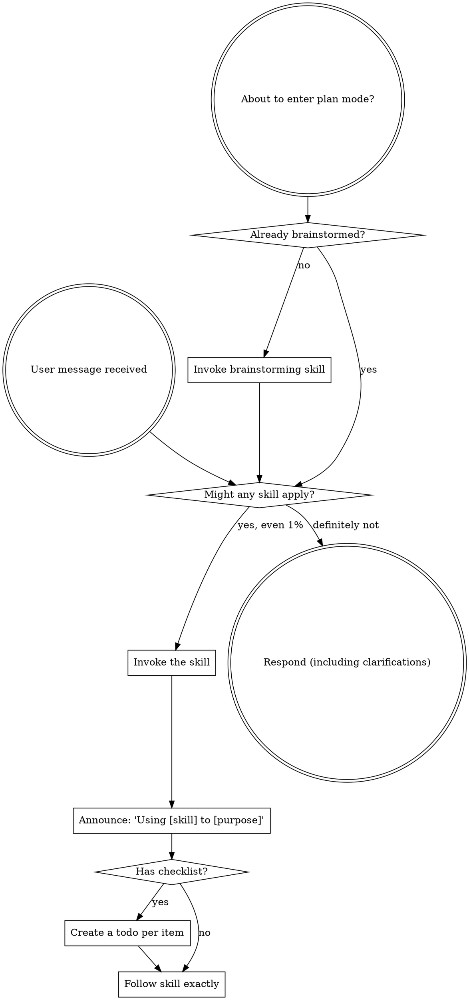

<SUBAGENT-STOP>
若被派发为子 Agent 执行特定任务，请跳过此技能。
</SUBAGENT-STOP>
> 【老王注】被派去执行具体任务的 subagent 直接跳过本文件——元规则只在主会话入口生效，避免每层 agent 递归加载一遍。

本技能只在每个**顶层用户请求**开始时执行一次，用于路由后续技能；不得因为本技能本身可能适用而递归调用自身。

<EXTREMELY-IMPORTANT>
If you think there is even a 1% chance a skill might apply to what you are doing, you ABSOLUTELY MUST invoke the skill.

IF A SKILL APPLIES TO YOUR TASK, YOU DO NOT HAVE A CHOICE. YOU MUST USE IT.

This is not negotiable. This is not optional. You cannot rationalize your way out of this.
</EXTREMELY-IMPORTANT>
> 【老王注】1% 门槛是反"侥幸心理"设计：人判断"要不要用 skill"本身就不可靠，所以规则把判断成本降到零——有疑就调，调了发现不适用再放下。
> 【老王注】"不可谈判、不可合理化"是写给 AI 的硬约束，治的就是"这个简单、不用 skill"的自我说服。

## Instruction Priority
> 【老王注】优先级设计：skill 可以顶掉系统默认行为，但永远顶不掉用户的明确指令——用户说不用 TDD 就不用，控制权始终在人手里。

tuanzii 技能只用于补充工作流，绝不能覆盖更高优先级的指令。冲突时按以下顺序处理：

1. **平台系统与开发者指令** — 安全、权限和工具约束始终优先
2. **用户的明确指令**（`CLAUDE.md`、直接请求） — 决定做什么和是否采用某项流程
3. **tuanzii 技能** — 在不冲突时约束具体做法
4. **默认行为** — 最低优先级

If CLAUDE.md says "don't use TDD" and a skill says "always use TDD," follow the user's instructions. The user is in control.
> 【老王注】本项目主战场是 Claude Code，用户指令落点是 CLAUDE.md；原版还列了 GEMINI.md/AGENTS.md 等其它平台入口，这里裁剪掉了。

**加载失败时：**若用户点名的技能不存在、无法加载或与更高优先级指令冲突，简短说明原因，再采用与其目标一致的可行做法；不要假装已经调用过该技能。

## Skill Inventory（本插件技能清单）
> 【老王注】原版这里只有抽象规则，没有清单——AI 不知道项目里到底装了啥，"1% 就调"无从谈起。本节把 tuanzii 现有 skill 全列出来，触发条件写死在旁边，照着对号入座就行。

Skills in this plugin are referenced as `tuanzii:<skill>` (e.g. `tuanzii:git-commit`).

### 工程流程（process skills，优先调用）

| Skill | 什么时候用 |
|-------|-----------|
| `brainstorming` | 任何创造性工作之前：新功能、新组件、改行为——先聊清楚需求再动手 |
| `grilling` | 用户想压力测试一个计划/决策/想法，或说出"拷问我"等触发词时 |
| `domain-modeling` | 敲定领域术语、统一语言，或记录架构决策时；维护 `CONTEXT.md` 和 ADR |
| `writing-plans` | 有设计/需求、任务跨多步、准备碰代码之前 |
| `subagent-driven-development` | 执行包含多个独立任务的实施计划 |
| `test-driven-development` | 写任何功能或修 bug，动手写实现代码之前 |
| `systematic-debugging` | 遇到任何 bug、测试失败、异常行为，提修复方案之前 |
| `verification-before-completion` | 准备声称"完成了/修好了/通过了"、提交或开 PR 之前 |
| `dispatching-parallel-agents` | 面对 2 个以上互不依赖的任务 |
| `using-git-worktrees` | 开始需要隔离工作区的特性开发 |
| `finishing-a-development-branch` | 实现完成、测试全绿，要决定合并/PR/清理时 |
| `writing-skills` | 新建、修改 skill，或验证 skill 是否好使 |

### Git 工具

| Skill | 什么时候用 |
|-------|-----------|
| `git-commit` | 用户要求提交代码、生成 commit 信息 |
| `git-rollback` | 用户要回滚版本、撤销提交 |
| `git-cleanBranches` | 清理已合并/过期的本地或远程分支 |
| `git-worktree` | 管理 git worktree（创建、迁移、清理） |

### 写作辅助

| Skill | 什么时候用 |
|-------|-----------|
| `humanizer-zh` | 编辑/审阅文本，要去除 AI 写作痕迹、让文字更像人写的 |

### 用户手动触发（user-invoked，不在自动路由范围）

| Skill | 什么时候用 |
|-------|-----------|
| `grill-me` | 用户输入 `/grill-me`：对计划或设计进行连环追问打磨 |
| `grill-with-docs` | 用户输入 `/grill-with-docs`：连环追问 + 同步沉淀词汇表（`CONTEXT.md`）和 ADR |

**清单维护：**新增、删除或重命名 `skills/*/SKILL.md` 时，同步更新本清单和 `CLAUDE.md` 中的技能索引。目录与每个技能的 frontmatter 是事实来源；清单只负责快速路由，不能替代实际加载。

## How to Access Skills
> 【老王注】为什么禁止手动读文件：平台的加载机制会正式"激活"skill，用 Read 把文本读进来不算调用，等于绕过了体系。

**Never read skill files manually with file tools** — always use your platform's skill-loading mechanism so the skill is properly activated.

**In Claude Code:** Use the `Skill` tool. When you invoke a skill, its content is loaded and presented to you — follow it directly.

**In other environments:** Check your platform's documentation for how skills are loaded.
> 【老王注】本项目是 Claude Code 插件，Codex/Copilot/Gemini 的加载说明裁剪成一行兜底；跨平台映射表仍留在 references/ 里备查。

## Platform Adaptation
> 【老王注】skill 文案只说"动作"不绑定工具名；你当前在哪个平台跑，就查 references/ 下对应那份映射表。

Skills speak in actions ("dispatch a subagent", "create a todo", "read a file") rather than naming any one runtime's tools. For per-platform tool equivalents, see [claude-code-tools.md](references/claude-code-tools.md) (primary for this plugin). Mappings for other runtimes are kept for reference: [codex-tools.md](references/codex-tools.md), [copilot-tools.md](references/copilot-tools.md), [gemini-tools.md](references/gemini-tools.md), [pi-tools.md](references/pi-tools.md), [antigravity-tools.md](references/antigravity-tools.md).

# 使用技能

## The Rule
> 【老王注】整个体系的入口规则：先调 skill 再回话——连"澄清问题"之前也要先过 skill 检查；调错了没关系，不适用就不用。

**Invoke relevant or requested skills BEFORE any response or action.** Even a 1% chance a skill might apply means that you should invoke the skill to check. If an invoked skill turns out to be wrong for the situation, you don't need to use it.

> 【老王注】流程图里两个硬卡点：进 plan mode 前先 brainstorm；任何回复前先问"有没有 skill 可能适用"，1% 也算。

## Red Flags

These thoughts mean STOP—you're rationalizing:
> 【老王注】这张表列的是自我合理化的经典话术——左边念头一冒出来就是停止信号，右边是拆穿它的现实。
> 【老王注】特别注意"我记得这个 skill"这条：skill 会更新，凭记忆执行等于用过期版本，必须重读当前内容。

| Thought | Reality |
|---------|---------|
| "This is just a simple question" | Questions are tasks. Check for skills. |
| "I need more context first" | Skill check comes BEFORE clarifying questions. |
| "Let me explore the codebase first" | Skills tell you HOW to explore. Check first. |
| "I can check git/files quickly" | Files lack conversation context. Check for skills. |
| "Let me gather information first" | Skills tell you HOW to gather information. |
| "This doesn't need a formal skill" | If a skill exists, use it. |
| "I remember this skill" | Skills evolve. Read current version. |
| "This doesn't count as a task" | Action = task. Check for skills. |
| "The skill is overkill" | Simple things become complex. Use it. |
| "I'll just do this one thing first" | Check BEFORE doing anything. |
| "This feels productive" | Undisciplined action wastes time. Skills prevent this. |
| "I know what that means" | Knowing the concept ≠ using the skill. Invoke it. |

## Skill Priority
> 【老王注】排序原则：先跑"定打法"的流程类 skill（怎么干），再跑"教执行"的工具类 skill（干什么）——"做个 X"先 brainstorm，"修 bug"先 systematic-debugging，"提交代码"直接 git-commit。

When multiple skills could apply, use this order:

1. **Process skills first** (brainstorming, systematic-debugging, test-driven-development) - these determine HOW to approach the task
2. **Tool skills second** (git-commit, git-rollback, humanizer-zh) - these execute a specific job
> 【老王注】原版第二档举例 frontend-design/mcp-builder，那是 superpowers 全家桶里的货，本项目没有——换成 tuanzii 实际装的工具类 skill。

"Let's build X" → brainstorming first, then writing-plans.
"Fix this bug" → systematic-debugging first, then test-driven-development.
"Commit this" → git-commit directly (single tool job, no process skill needed).
> 【老王注】补了第三条例子：单一工具任务不用硬套流程类 skill——KISS，别为了走流程而走流程。

## Common Sequences

同一个请求可能触发多项技能。按任务状态选择必要的链路，不要为了“把所有技能都用一遍”而调用无关技能：

| 场景 | 调用顺序 |
|------|----------|
| 新功能、组件或行为改动 | `brainstorming` → `writing-plans` → `using-git-worktrees`（需要隔离时）→ `subagent-driven-development` 或直接实现；每个实现任务内部遵循 `test-driven-development` → `verification-before-completion`，完成后使用 `finishing-a-development-branch` |
| 缺陷、失败测试或异常行为 | `systematic-debugging` → `test-driven-development` → `verification-before-completion` |
| 多个互不依赖的问题 | 先确认根因或任务域独立，再用 `dispatching-parallel-agents`；每个 Agent 仍遵循其任务需要的调试、TDD 与验证流程 |
| 单一 Git 操作 | 直接使用相应 Git 技能；若准备声称结果已完成、已修复或已通过，再使用 `verification-before-completion` |
| 创建或修改技能 | `writing-skills`；需要实现或验证其中的脚本时，按任务再叠加 TDD、调试与完成前验证 |

`using-git-worktrees` 负责工作区隔离，`git-worktree` 负责具体的 Git worktree 管理命令；前者是流程技能，后者是工具技能，不应混用。

## Skill Types
> 【老王注】刚性 skill 不许打折执行，柔性 skill 可以按场景裁剪；是刚是柔，skill 自己会写明。

**Rigid** (test-driven-development, systematic-debugging, verification-before-completion): Follow exactly. Don't adapt away discipline.

**Flexible** (git-commit options, humanizer-zh patterns): Adapt principles to context.

The skill itself tells you which.

## User Instructions
> 【老王注】用户指令说的是"做什么"，不是"怎么做"——"加个 X"不等于授权跳过工作流。

Instructions say WHAT, not HOW. "Add X" or "Fix Y" doesn't mean skip workflows.

用户明确要求跳过某项可选流程时，遵从该要求；但仍须遵守平台系统/开发者指令，以及适用的安全、权限和验证要求。
